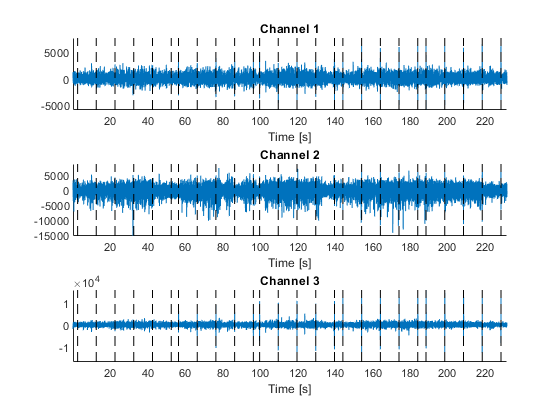
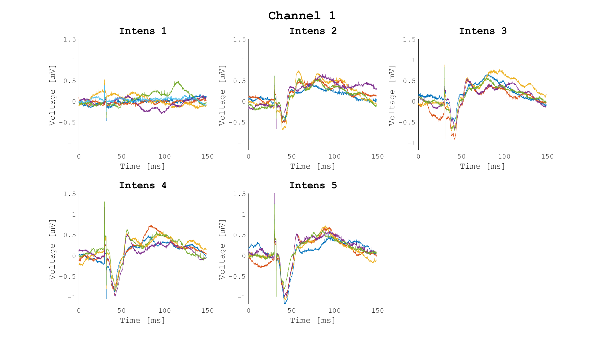
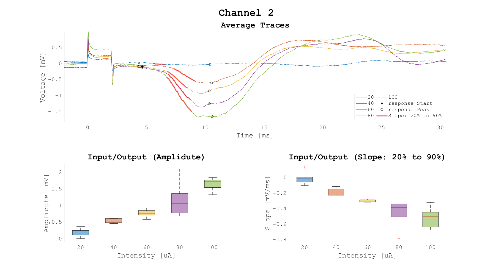

# Welcome to the Slutsky Lab fEPSP Repository!

Here you will find resources for recording *in vivo* field excitatory post synaptic potentials (fEPSPs) and a MATLAB© based package for analysis of the recorded signals.

## Resources

- Stimulation protocols written for winWCP and Arduino
- A spreadsheet for easy localization of implant coordinates during surgery
- CAD files for printing and/or machining components designed for custom head fixation apparatus

## Analysis

**See the ExampleData directory for a full rundown of the analysis functions.**

### Pipeline

#### Before you begin
Prepare the raw data including times of stimulus onset. 

 

#### fepsp_org2traces
Organizes the raw data according to the stimulus protocol, number of channels, number of intensities, etc... 
Allows removing the trend (mean and slope) from individual traces. 
Outputs traces in a cell array. The format of traces if crucial for the rest of the pipeline.

 

#### fepsp_markings
GUI for manually marking the start and peak of each trace. 
The number of marker pairs is determined by the number of stimuli in a trace. 
Compensates for small inaccuracies in the manual markings by jittering in time the markers closer to the peak. 
Allows removal or inversion of individual traces.  
Provides easy navigation between all channels and intensities. 
In 'fast mode', only the highest intensity per channel will be presented by default.

 

**fepsp_analyse** - Calculate slope and amplitude for each trace and the average fepsp_org2traces. 
**fepsp_summaryPlot** - Summary plot of the data after analysis.

 

#### Notes
- The pipeline assumes each recording is in its own directory and will use the name of that directory when saving files. For example, if the recording is in a directory called */user/../mouse1_io1* then the output of fepsp_org2traces will be *mouse1_io1_traces.mat*
- For your convenience, all functions work with MATLAB's tab autocompletion.
- The analysis package is open software in accordance with the GNU General Public License version 3.0.

#### Requirements

- Hardware: This package can run on any computer capable of running MATLAB 2019a.
- Software: This package requires MATLAB© 2019a or higher with the following toolboxes:
    - Image Processing Toolbox™,
    - Signal Processing Toolbox™
    - Statistics and Machine Learning Toolbox™

#### Citation
The analysis package was written by Lior de Marcas and Leore R. Heim. 
Cite as: Heim et al., STAR protocol.
